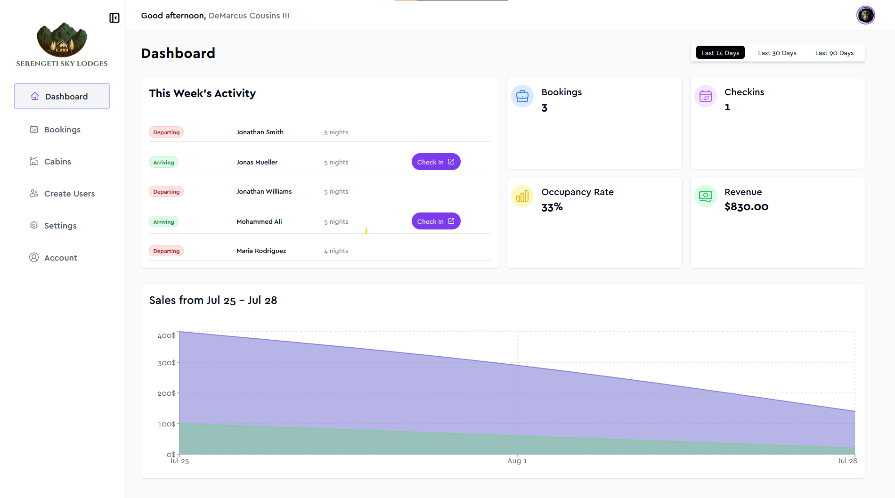

  

# Serengeti Sky Lodges

Escape to Serengeti Sky Lodges, where untamed beauty and luxury intertwine, offering a serene retreat amidst the captivating wilderness of the iconic Serengeti.

## Features

- 🏞️ Luxurious Lodges amidst Serengeti's wilderness
- 🍽️ Farm-to-Table Cuisine at our Charming Restaurant
- 🌌 Stargazing and Wildlife Safari Adventures
- 💆‍♂️ Soothing Spa for Relaxation and Rejuvenation
- 🚀 Next.js for Lightning-fast Performance
- 🛂 Secure Authentication with Supabase
- 📝 Full CRUD Functionality
- 💻 Responsive Design for Seamless Experience

## Demo

## Installation

1. Clone the repository: `git clone https://github.com/PresidentIsmail/Serengeti-Sky-Lodges`
2. Navigate to the project directory: `cd Serengeti-Sky-Lodges`
3. Install dependencies: `npm install`

## Usage

1. Sign up for a free account on Supabase (https://supabase.io/) and obtain your API credentials.
2. Create a `.env.local` file in the root directory and add your Supabase credentials:
`NEXT_PUBLIC_SUPABASE_URL=your_supabase_url
NEXT_PUBLIC_SUPABASE_ANON_KEY=your_supabase_anon_key
`
3. Start the app: `npm run dev`
4. Open your browser and visit `http://localhost:3000` to experience Serengeti Sky Lodges!

## Live Website

Experience Serengeti Sky Lodges live at [serengeti-sky-lodges.vercel.app](https://serengeti-sky-lodges.vercel.app)

## License

This project is licensed under the [MIT License](LICENSE).
